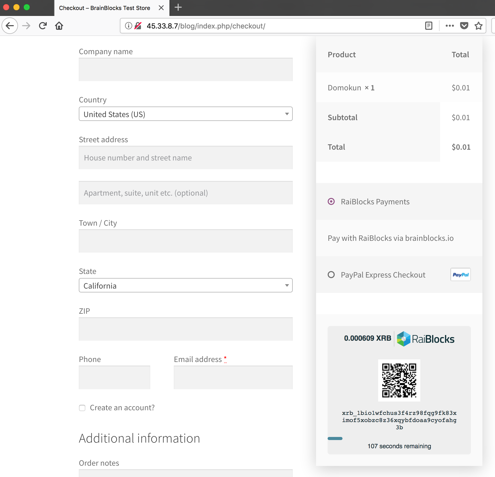
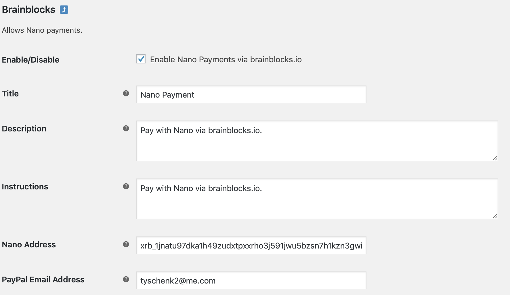

# woocommerce-brainblocks

WooCommerce plugin for [BrainBlocks](https://brainblocks.io), a fast, free, easy RaiBlocks payment gateway



## Setup

1. Clone the repo:

   ```bash
   git clone https://github.com/brainblocks/woocommerce-brainblocks.git
   cd woocommerce-brainblocks
   ```
   
2. Upload the `woocommerce-gateway-brainblocks` directory to your `wp-content/plugins` directory:

   ```bash
   rsync -r woocommerce-gateway-brainblocks user@mysite.com:/usr/share/wordpress/wp-content/plugins/
   ```
   
3. Activate the plugin in the WordPress plugins section:

   

4. Configure the plugin and add your receiving RaiBlocks address:

   


